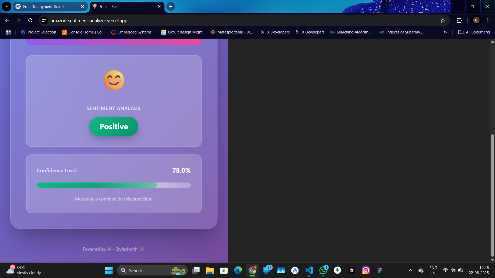

# 🛍️ Amazon Product Review Sentiment Analyzer

Discover the emotional tone behind Amazon product reviews using Machine Learning.  
This full-stack application combines a Flask backend for model inference and a React frontend for an intuitive user interface.


---

## 🌐 Live Demo

**Frontend**: https://your-ngrok-url.ngrok-free.app/  
**API Endpoint**: https://your-ngrok-url.ngrok-free.app/predict?text=your+sample+review

---

## 📦 Features

- 🔎 Real-time sentiment analysis (Positive / Negative)
- 🤖 ML model trained on 3M+ Amazon product reviews
- 📊 Confidence scores with natural language responses
- ⚙️ Dockerized (frontend & backend)
- 🚀 CI/CD with GitHub Actions
- 🔗 Webhook support for Jenkins

---

## 🧠 Tech Stack

| Layer     | Technology |
|-----------|------------|
| Frontend  | React (Vite + JSX), Tailwind CSS |
| Backend   | Flask, scikit-learn, Python |
| ML Model  | Logistic Regression with TF-IDF vectorizer |
| CI/CD     | GitHub Actions, Jenkins, Ngrok |
| Docker    | Multi-stage build (Node + Nginx), Flask container |
| Dataset   | [Amazon Reviews (FastText format)](https://dl.fbaipublicfiles.com/fasttext/supervised-learning/amazon_review_polarity.tar.gz) |

---

## 🚀 Quick Start

### 1. Clone the Repo
```bash
git clone https://github.com/Gautam-Yedla/amazon-sentiment-analyzer.git
cd amazon-sentiment-analyzer
2. Build & Run with Docker
bash
Copy code
docker compose -f docker/docker-compose.yml up --build
3. Access the App
Frontend: http://localhost:8080

Backend API: http://localhost:5000/predict?text=This+product+is+great

🧪 Model Training
Run the training script:

bash
Copy code
cd backend/model
python train_model.py
Trained model + vectorizer will be saved as sentiment_model.pkl and vectorizer.pkl.

🔄 API Endpoints
Method	Route	Description
GET	/ping	Health check
GET	/predict?text=sample	Returns prediction + confidence

🧪 Sample Response
json
Copy code
{
  "text": "Amazing product quality!",
  "prediction": "Positive",
  "confidence": 0.9914
}
⚙️ GitHub Actions CI
GitHub Actions is set up to:

✅ Lint Python backend

✅ Check frontend build

✅ Run basic test suite

.github/workflows/main.yml
yaml
Copy code
name: CI Pipeline

on:
  push:
    branches: [ "main" ]
  pull_request:
    branches: [ "main" ]

jobs:
  build-backend:
    runs-on: ubuntu-latest
    steps:
      - uses: actions/checkout@v3
      - name: Set up Python
        uses: actions/setup-python@v4
        with:
          python-version: "3.11"
      - name: Install dependencies
        run: |
          cd backend
          pip install -r requirements.txt
      - name: Run Python lint
        run: |
          cd backend
          python -m py_compile app.py

  build-frontend:
    runs-on: ubuntu-latest
    steps:
      - uses: actions/checkout@v3
      - name: Set up Node
        uses: actions/setup-node@v3
        with:
          node-version: '20'
      - name: Install & build
        run: |
          cd frontend
          npm install
          npm run build
🧪 Jenkins Integration (Optional)
✅ Install GitHub plugin in Jenkins

✅ Use GitHub hook trigger for GITScm polling

✅ Add webhook to GitHub:

arduino
Copy code
https://<your-ngrok-url>.ngrok-free.app/github-webhook/
📝 License
MIT License © 2025 Gautam Yedla

🙌 Acknowledgements
Dataset from Facebook AI FastText project

scikit-learn & Flask for model deployment

Docker & Jenkins for modern devops

yaml
Copy code

---

# 